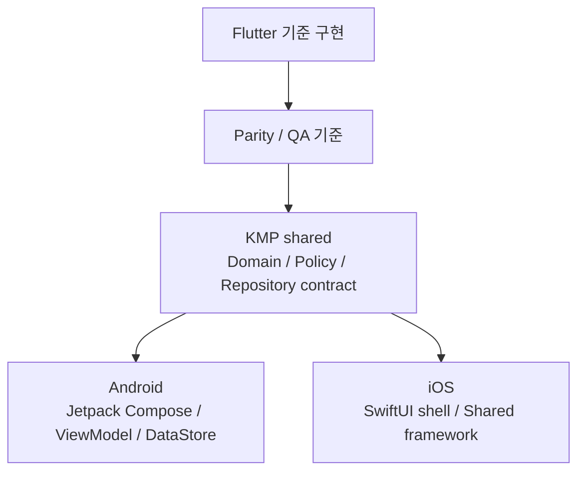
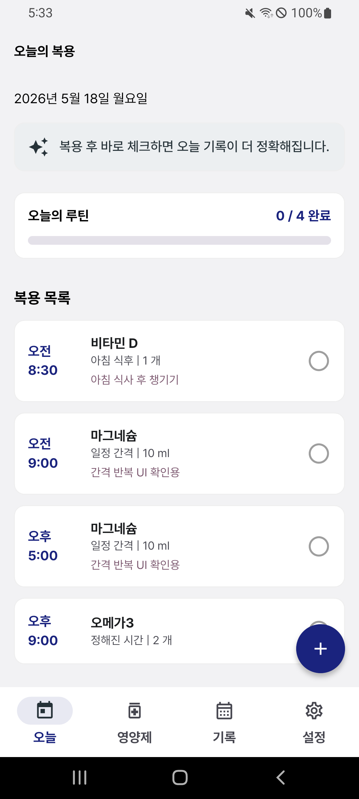
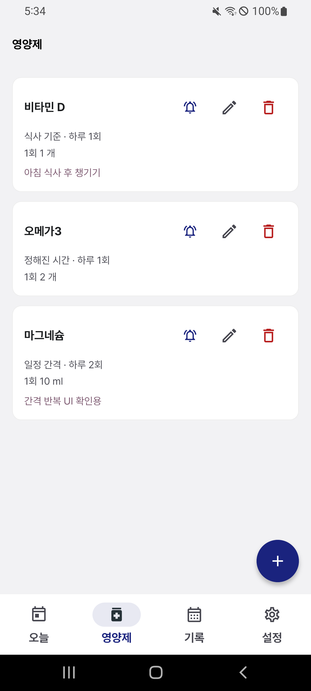
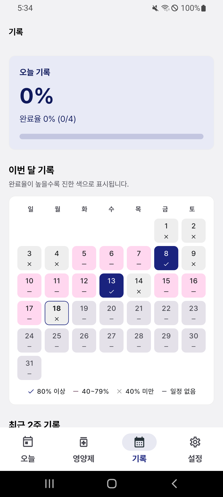
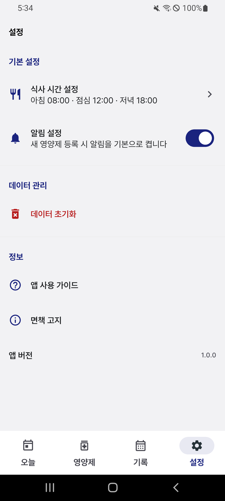
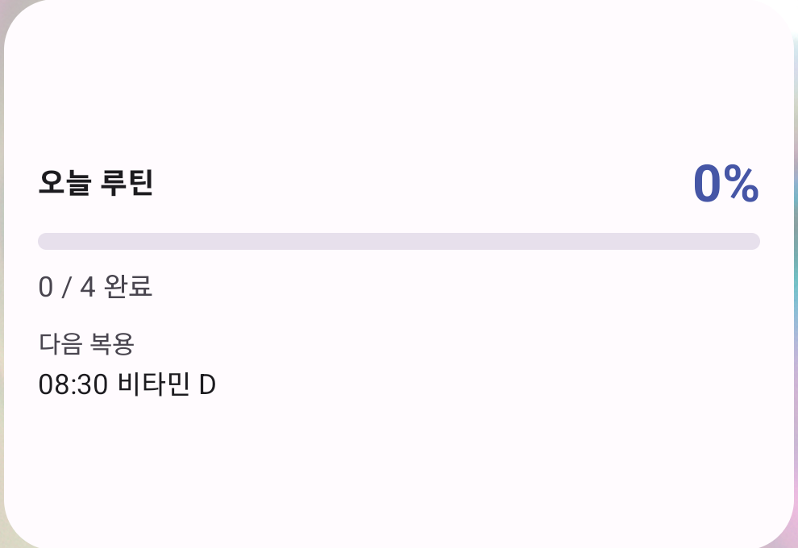
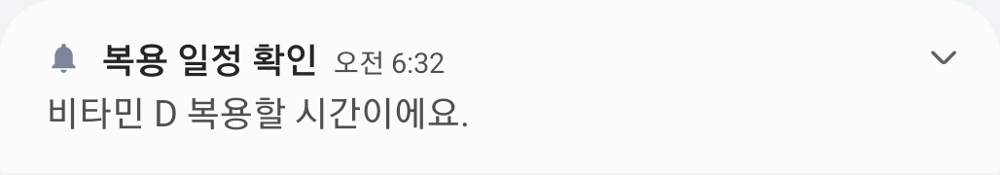

# Supplement Routine

> 사용자가 직접 입력한 영양제 복용 규칙을 기반으로 오늘의 복용 일정, 체크, 기록, 알림을 관리하는 local-first 루틴 앱입니다. 현재 Flutter 기준 구현을 유지하면서 KMP shared와 Android Jetpack Compose로 Android 우선 출시를 진행하고, iOS 출시는 후속으로 보류했습니다.

[English README](README_en.md)

## 현재 상태

| 영역 | 상태 |
| --- | --- |
| Android KMP | Android 우선 출시 범위. 최신 `KMP Release` run `27008729353`에서 signed APK/AAB 생성과 서명 검증 완료 |
| iOS KMP | SwiftUI shell, shared framework, UserDefaults persistence, UserNotifications adapter 구현. 출시는 후속으로 보류 |
| Flutter | Android store cutover와 iOS 출시 재개 결정 전까지 기준 구현과 rollback reference로 유지 |
| CI | Flutter CI, KMP Android/shared CI, iOS framework + SwiftUI shell build CI 구성 |
| 남은 차단 조건 | Play Console 앱 등록, 콘텐츠 등급, 데이터 보안, 스토어 등록정보, 심사 제출 |

최신 릴리스 준비 상태는 [릴리스 준비 문서](docs/release_readiness.md)를 기준으로 관리합니다.

## 프로젝트 소개

Supplement Routine은 영양제 추천 앱이나 의료 조언 앱이 아닙니다. 사용자가 이미 복용하기로 정한 영양제를 직접 등록하고, 입력한 규칙을 기준으로 오늘의 일정과 복용 기록을 관리하는 작은 루틴 관리 앱입니다.

앱의 목표는 단순합니다.

- 오늘 어떤 영양제를 복용해야 하는지 빠르게 확인한다.
- 복용 후 바로 체크해서 기록을 남긴다.
- 최근 기록과 완료율을 보고 루틴을 점검한다.
- 정해진 시간에 어떤 영양제를 먹어야 하는지 알림으로 확인한다.

## 주요 기능

| 기능 | 설명 |
| --- | --- |
| 오늘 화면 | 오늘 날짜, 진행률, 복용 목록, 복용 체크를 제공합니다. |
| 영양제 등록/수정 | 이름, 복용 방식, 복용 조건, 복용량, 알림 여부, 메모를 입력합니다. |
| 복용 일정 계산 | 식사 기준, 정해진 시간, 일정 간격 방식으로 오늘 일정을 생성합니다. |
| 복용 기록 | 오늘 완료율, 월간 완료 상태, 최근 기록을 확인합니다. |
| 로컬 저장 | 영양제, 복용 기록, 식사 시간, 알림 기본값을 기기 로컬 저장소에 보관합니다. |
| 알림 | Android notification runtime permission, exact alarm fallback, 즉시/예약 테스트 알림을 지원합니다. |
| iOS shell | SwiftUI 기반 Today/Supplements/History/Settings shell과 shared module 연동을 제공합니다. |
| 설정 | 식사 시간, 기본 알림, 권한 상태, 데이터 초기화, 사용 가이드, 면책 고지를 제공합니다. |

## 앱 정책

Supplement Routine은 다음 기능을 제공하지 않습니다.

- 특정 영양제 추천
- 영양제 효능 설명
- 질병 예방, 치료, 완화 표현
- 흡수율, 음식 조합, 영양제 조합 추천
- 의료적 판단이나 진단

앱은 사용자가 입력한 정보를 일정과 기록으로 관리하는 도구입니다. 영양제 복용과 관련된 결정은 전문가와 상담해야 합니다.

## 기술 스택

| 영역 | 기술 |
| --- | --- |
| 기준 구현 | Flutter, Dart, Riverpod |
| Shared logic | Kotlin Multiplatform |
| Android native | Kotlin, Jetpack Compose, Material 3, Hilt, MVVM, DataStore |
| iOS native | SwiftUI, KMP shared framework, UserDefaults, UserNotifications |
| Notification | Android native notification/exact alarm adapter, iOS UserNotifications adapter, Flutter local notifications |
| Design System | Material 3, Pretendard, warm white/berry/coral/mint/ink token |
| CI/CD | GitHub Actions: Flutter CI, KMP CI, iOS KMP CI, KMP Release |

자세한 선택 이유는 [Tech Stack 문서](docs/tech_stack.md)를 기준으로 봅니다.

## 아키텍처 방향

이 프로젝트는 local-first 루틴 앱을 Android/iOS에서 유지보수할 수 있도록 SSOT, Clean Architecture, SOLID, MVVM, state hoisting 원칙을 따릅니다. Flutter 구현은 기준 구현으로 남겨두고, 새 구현은 KMP shared domain/data contract와 플랫폼별 native UI를 중심으로 옮겼습니다.



현재 원칙:

- shared domain model을 제품 상태의 기준으로 둡니다.
- 저장된 데이터의 진실은 repository implementation에 둡니다.
- Android Compose 화면은 ViewModel `UiState`를 렌더링하고 이벤트만 올립니다.
- 플랫폼 API는 Android/iOS adapter 뒤에 둡니다.
- 건강 관련 조언으로 오해될 수 있는 문구와 기능은 추가하지 않습니다.

## 폴더 구조

```text
lib/                         Flutter 기준 구현
android/                     Flutter Android wrapper와 기존 native Android 구성
ios/                         Flutter iOS wrapper
kmp/
├── shared/                  KMP shared domain, data contract, pure logic
├── androidApp/              Jetpack Compose Android native app
└── iosApp/                  SwiftUI iOS shell, Xcode project
docs/                        PRD, design system, tech stack, parity, release docs
.codex/skills/               이 프로젝트 전용 작업 규칙
```

## 실행 방법

### Flutter 기준 앱

```bash
flutter pub get
flutter run
```

debug mock 데이터 사용:

```bash
flutter run --dart-define=MOCK_DATA=true
```

mock 데이터 없이 빈 상태 확인:

```bash
flutter run --dart-define=MOCK_DATA=false
```

### KMP Android 앱

Windows/Android 개발 환경에서는 저장소 루트에서 다음 명령을 사용합니다.

```powershell
$env:ANDROID_HOME="$env:LOCALAPPDATA\Android\Sdk"
$env:ANDROID_SDK_ROOT=$env:ANDROID_HOME
android\gradlew.bat -p kmp :shared:check :androidApp:assembleDebug --no-daemon
```

debug APK:

```text
kmp/androidApp/build/outputs/apk/debug/androidApp-debug.apk
```

release APK/AAB:

```powershell
$env:ANDROID_HOME="$env:LOCALAPPDATA\Android\Sdk"
$env:ANDROID_SDK_ROOT=$env:ANDROID_HOME
android\gradlew.bat -p kmp :shared:check :androidApp:assembleRelease :androidApp:bundleRelease --no-daemon
```

### KMP iOS 앱

iOS SwiftUI shell은 macOS/Xcode가 필요합니다. Windows에서는 직접 실행할 수 없고 GitHub-hosted macOS runner에서 빌드를 검증합니다.

```bash
gradle -p kmp :shared:linkDebugFrameworkIosSimulatorArm64 --no-daemon
xcodebuild \
  -project kmp/iosApp/SupplementRoutineIos.xcodeproj \
  -scheme SupplementRoutineIos \
  -configuration Debug \
  -sdk iphonesimulator \
  -destination "generic/platform=iOS Simulator" \
  ARCHS=arm64 \
  ONLY_ACTIVE_ARCH=YES \
  CODE_SIGNING_ALLOWED=NO \
  build
```

## 릴리스와 서명

Android signing은 GitHub Secrets 기반 `KMP Release` workflow로 signed APK/AAB artifact 생성과 검증까지 완료했습니다. 최신 Android 제출 후보는 run `27008729353`의 `kmp-android-release` artifact입니다.

iOS signed archive/IPA workflow는 준비되어 있지만, 이번 출시는 Android 우선으로 진행하므로 iOS signing/provisioning은 후속 출시 재개 시 처리합니다.

Play Console 자동 제출은 아직 구성하지 않았습니다. 현재 repository에는 Play Console service account secret이 없으므로, 계정 소유자가 최신 AAB를 Play Console에 업로드하고 심사 제출해야 합니다.

iOS 출시를 재개할 때 필요한 자산은 다음과 같습니다.

- Apple distribution certificate `.p12`
- provisioning profile `.mobileprovision`
- certificate password
- Apple Team ID
- iOS Bundle ID

비밀 값, keystore 비밀번호, certificate, provisioning profile, 민감한 API key는 코드와 Git 저장소에 포함하지 않습니다. 자세한 절차는 [릴리스 서명 문서](docs/release_signing.md)를 봅니다.

## 검증 방법

### Flutter

```bash
flutter analyze
flutter test
flutter build apk --debug
```

### KMP Android/shared

```powershell
$env:ANDROID_HOME="$env:LOCALAPPDATA\Android\Sdk"
$env:ANDROID_SDK_ROOT=$env:ANDROID_HOME
android\gradlew.bat -p kmp :shared:check :androidApp:assembleDebug --no-daemon
```

### KMP iOS

`.github/workflows/ios_kmp_ci.yml`에서 macOS runner가 `SupplementRoutineShared` framework와 SwiftUI shell build를 검증합니다.

## QA 상태

완료된 주요 검증:

- Android release APK/AAB assemble, bundle, lint
- Android signed APK/AAB artifact 생성과 서명 검증
- Android release APK install/launch smoke
- Android phone/expanded-width screenshot QA
- Android notification runtime permission dialog 거부/허용
- Android exact alarm settings/fallback
- Android 즉시/예약 notification 발화
- iOS shared release XCFramework build
- iOS SwiftUI shell simulator build CI

남은 외부 의존:

- 실제 사용자 루틴 시간대 장시간 알림 QA
- Play Console 앱 등록, 콘텐츠 등급, 데이터 보안, 스토어 등록정보, 심사 제출
- Play Console 자동 제출용 service account secret 등록
- iOS signing/provisioning, signed archive/IPA, screenshot/accessibility QA는 후속 출시로 보류

## 문서

- [PRD](docs/prd.md)
- [정보 구조](docs/information_architecture.md)
- [사용자 흐름](docs/user_flow.md)
- [디자인 시스템](docs/design_system.md)
- [Tech Stack](docs/tech_stack.md)
- [KMP parity](docs/kmp_parity_check.md)
- [릴리스 준비 상태](docs/release_readiness.md)
- [릴리스 서명](docs/release_signing.md)
- [Android Play Console 제출 준비](docs/play_console_android_submission.md)
- [개인정보처리방침](docs/privacy_policy.md)
- [CI/CD](docs/ci_cd.md)
- [Windows 지원](docs/windows_support.md)

## 화면 미리보기

| 오늘 | 영양제 |
| --- | --- |
|  |  |

| 기록 | 설정 |
| --- | --- |
|  |  |

### Android 홈 위젯



### 복용 알림



## 라이선스

현재 라이선스는 명시되어 있지 않습니다. 배포 전 프로젝트 목적에 맞는 라이선스를 결정해야 합니다.
