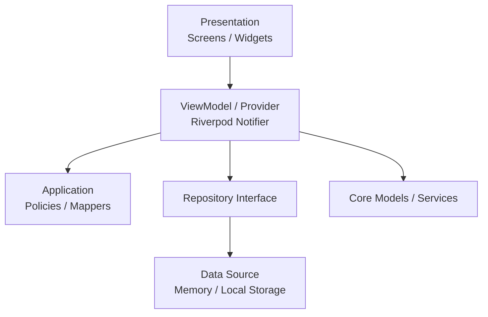

# Supplement Routine

> 사용자가 직접 입력한 영양제 복용 규칙을 기반으로 오늘의 복용 일정, 체크, 기록, 알림, 홈 위젯을 관리하는 Flutter Android 앱입니다.

[English README](README_EN.md)

## 프로젝트 소개

Supplement Routine은 영양제 추천 앱이나 의료 조언 앱이 아닙니다. 사용자가 이미 복용하기로 정한 영양제를 직접 등록하고, 입력한 규칙을 기준으로 오늘의 일정과 복용 기록을 관리하는 작은 루틴 관리 앱입니다.

앱의 핵심 목표는 단순합니다.

- 오늘 어떤 영양제를 복용해야 하는지 빠르게 확인한다.
- 복용 후 바로 체크해서 기록을 남긴다.
- 최근 기록과 완료율을 보고 루틴을 점검한다.
- 정해진 시간에 어떤 영양제를 먹어야 하는지 알림으로 확인한다.

## 주요 기능

| 기능 | 설명 |
| --- | --- |
| 오늘 화면 | 오늘 날짜, 오늘의 한 줄, 진행률, 복용 목록, 복용 체크를 제공합니다. |
| 영양제 등록/수정 | 이름, 복용 방식, 복용 조건, 복용량, 알림 여부, 메모를 입력합니다. |
| 복용 일정 계산 | 식사 기준, 정해진 시간, 일정 간격 방식으로 오늘 일정을 생성합니다. |
| 복용 기록 | 날짜별 완료율과 최근 2주 기록을 확인합니다. |
| 로컬 저장 | 영양제, 복용 기록, 설정값을 기기 로컬 저장소에 보관합니다. |
| 알림 | 등록한 영양제 이름을 포함해 복용 시간을 알려줍니다. |
| Android 홈 위젯 | 오늘 루틴 진행률과 다음 복용 항목을 홈 화면에서 확인합니다. |
| 설정 | 식사 시간, 기본 알림 설정, 데이터 초기화, 사용 가이드, 면책 고지를 제공합니다. |

## 앱 정책

Supplement Routine은 다음 기능을 제공하지 않습니다.

- 특정 영양제 추천
- 영양제 효능 설명
- 질병 예방, 치료, 완화 표현
- 흡수율, 음식 조합, 영양제 조합 추천
- 의료적 판단이나 진단

앱은 사용자가 입력한 정보를 일정과 기록으로 관리하는 도구입니다. 영양제 복용과 관련된 결정은 전문가와 상담해야 합니다.

## 기술 스택

| 영역 | 기술 |
| --- | --- |
| Framework | Flutter |
| Language | Dart |
| State Management | Riverpod Notifier |
| Architecture | Feature-based MVVM, 점진적 Clean Architecture |
| Local Storage | SharedPreferencesWithCache |
| Localization | flutter_localizations, intl, ARB |
| Notification | flutter_local_notifications, timezone, flutter_timezone |
| Android Widget | Native Android AppWidgetProvider |
| Design System | Material Design 3, ThemeData, ColorScheme, TextTheme |
| Font | Pretendard |
| Test | flutter_test |

## 아키텍처 방향

이 프로젝트는 MVP 범위를 유지하면서도 출시 가능한 앱 구조를 목표로 합니다. 처음부터 과도하게 계층을 쪼개기보다, 기능이 필요해지는 시점에 `data`, `application`, `presentation` 계층을 점진적으로 추가합니다.



### 현재 원칙

- UI는 상태를 읽고 이벤트만 전달합니다.
- 상태 변경은 Riverpod Notifier와 Repository를 통해 처리합니다.
- 사용자에게 보이는 문자열은 ARB localization 구조에서 관리합니다.
- 색상, 폰트, 간격, radius는 디자인 토큰과 ThemeData 중심으로 관리합니다.
- mock 데이터는 저장소 내부 기본값이 아니라 환경 설정에서 명시적으로 주입합니다.
- 건강 관련 조언으로 오해될 수 있는 문구와 기능은 추가하지 않습니다.

## 폴더 구조

```text
lib/
├── app/
│   ├── app_config.dart
│   ├── app_theme.dart
│   ├── app_colors.dart
│   ├── app_typography.dart
│   ├── app_spacing.dart
│   ├── app_radius.dart
│   └── supplement_routine_app.dart
├── core/
│   ├── models/
│   ├── services/
│   └── utils/
├── features/
│   ├── today/
│   ├── supplement/
│   │   ├── application/
│   │   ├── data/
│   │   └── presentation/
│   ├── history/
│   │   └── data/
│   └── settings/
│       └── data/
└── l10n/
    ├── app_ko.arb
    └── generated/
```

Android 홈 위젯과 네이티브 리소스는 `android/app/src/main` 아래에서 관리합니다.

## 실행 방법

### 사전 준비

- Flutter SDK
- Android Studio
- Android Emulator 또는 Android 기기

### 패키지 설치

```bash
flutter pub get
```

### 앱 실행

```bash
flutter run
```

### debug mock 데이터 사용

debug 빌드에서는 기본적으로 mock 데이터가 활성화되어 UI 확인이 쉽도록 구성되어 있습니다.

```bash
flutter run --dart-define=MOCK_DATA=true
```

mock 데이터 없이 빈 상태를 확인하려면 다음처럼 실행합니다.

```bash
flutter run --dart-define=MOCK_DATA=false
```

## 환경 설정

`AppConfig`는 `--dart-define` 기반 환경값을 사용합니다.

| Key | 기본값 | 설명 |
| --- | --- | --- |
| `APP_NAME` | `Supplement Routine` | 앱 이름 |
| `APP_FLAVOR` | `dev` | 실행 환경 |
| `APP_VERSION` | `1.0.0` | 앱 버전 표시용 값 |
| `LOG_LEVEL` | `debug` | 로그 레벨 |
| `MOCK_DATA` | debug: true, release: false | 개발용 mock 데이터 사용 여부 |

비밀 값, keystore 비밀번호, 민감한 API key는 코드와 Git 저장소에 포함하지 않는 것을 원칙으로 합니다.

## 검증 방법

### 정적 분석

```bash
flutter analyze
```

### 테스트

```bash
flutter test
```

### Android debug 빌드

```bash
flutter build apk --debug
```

## 디자인 시스템

Supplement Routine은 Android 우선 앱으로 Material Design 3를 따릅니다.

- `ThemeData(useMaterial3: true)` 기반
- `ColorScheme` 중심 색상 관리
- Pretendard 정적 폰트 적용
- `AppSpacing`, `AppRadius`, `AppComponents` 기반 공통 UI 토큰
- Light/Dark Theme 대응
- 과한 장식보다 정보 구조와 반복 사용성을 우선

자세한 디자인 결정은 다음 문서를 참고합니다.

- [디자인 시스템 문서](docs/design_system_ko.md)
- [Design System](docs/design_system.md)
- [Android 릴리즈 서명](docs/release_signing_ko.md)

## 테스트 범위

현재 테스트는 다음 영역을 검증합니다.

- 앱 시작과 주요 탭 렌더링
- 영양제 등록, 수정, 삭제
- 복용량 validation
- 알림 설정 기본값과 영양제별 알림 토글
- 오늘 일정 생성과 복용 체크
- 복용 기록 저장과 완료율 계산
- 최근 2주 기록 ViewModel
- 로컬 저장소 serialization
- 홈 위젯 요약 계산
- 알림 문구에 영양제 이름 포함 여부

## 현재 상태

현재 구현된 범위는 MVP 기반의 출시 준비 구조입니다.

- feature 기반 구조 유지
- Riverpod Notifier 기반 상태 관리
- 로컬 저장소 연결
- localization 구조 적용
- Material Design 3 기반 디자인 시스템 적용
- Android 알림과 홈 위젯 기본 구현
- 테스트와 debug APK 빌드 통과

## 향후 작업

- 알림 채널/본문 문구의 localization 정리
- 영양제 등록 화면의 디자인 토큰 추가 정리
- 기록 화면의 월간 캘린더 UX 개선
- 앱 아이콘과 스토어 등록용 그래픽 정리
- 스크린샷/GIF 추가

## 라이선스

현재 라이선스는 명시되어 있지 않습니다. 배포 전 프로젝트 목적에 맞는 라이선스를 결정해야 합니다.
