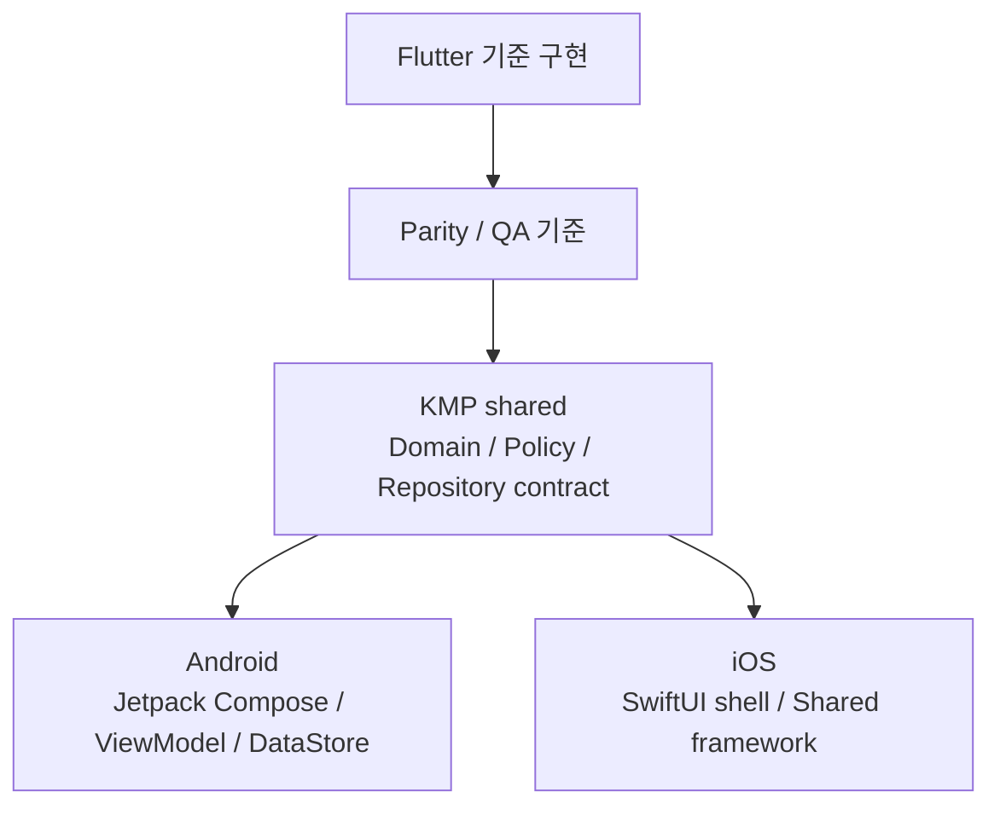
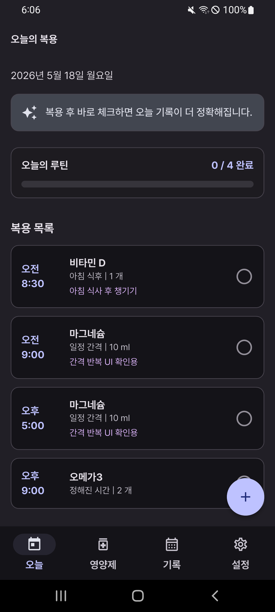
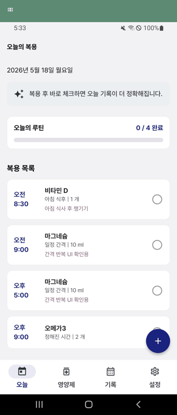

# Supplement Routine

> 사용자가 직접 입력한 영양제 복용 규칙을 기반으로 오늘의 복용 일정, 체크, 기록, 알림을 관리하는 local-first 루틴 앱입니다. 현재 Flutter 기준 구현을 유지하면서 KMP shared, Android Jetpack Compose, iOS SwiftUI 앱으로 전환 중입니다.

[English README](README_en.md)

> 참고: 이 README는 현재 전환 상태를 설명하기 위한 최소 갱신본입니다. 최종 릴리즈 README는 QA, iOS persistence/notification adapter, Flutter cutover 결정이 끝난 뒤 다시 정리합니다.

## 프로젝트 소개

Supplement Routine은 영양제 추천 앱이나 의료 조언 앱이 아닙니다. 사용자가 이미 복용하기로 정한 영양제를 직접 등록하고, 입력한 규칙을 기준으로 오늘의 일정과 복용 기록을 관리하는 작은 루틴 관리 앱입니다.

앱의 핵심 목표는 단순합니다.

- 오늘 어떤 영양제를 복용해야 하는지 빠르게 확인한다.
- 복용 후 바로 체크해서 기록을 남긴다.
- 최근 기록과 완료율을 보고 루틴을 점검한다.
- 정해진 시간에 어떤 영양제를 먹어야 하는지 알림으로 확인한다.

## 현재 전환 상태

| 영역 | 현재 상태 |
| --- | --- |
| Flutter 앱 | 기존 기준 구현입니다. KMP parity가 검증되기 전까지 제품 동작과 스크린샷 reference로 유지합니다. |
| KMP shared | domain model, scheduling, history summary, repository contract, DTO mapper, form validation policy를 공유합니다. |
| Android native | Jetpack Compose 기반 앱이 Today, Supplements, History, Settings, DataStore persistence, notification adapter, haptic intent, 새 디자인 token을 사용합니다. |
| iOS native | SwiftUI shell이 `SupplementRoutineShared` framework를 import/call합니다. local persistence와 notification adapter는 후속 작업입니다. |
| CI | Flutter CI, KMP Android/shared CI, iOS shared framework + SwiftUI shell build CI를 분리해서 검증합니다. |

자세한 현재 gap은 [KMP parity 문서](docs/kmp_parity_check.md)를 기준으로 봅니다.

## 주요 기능

| 기능 | 설명 |
| --- | --- |
| 오늘 화면 | 오늘 날짜, 오늘의 한 줄, 진행률, 복용 목록, 복용 체크를 제공합니다. |
| 영양제 등록/수정 | 이름, 복용 방식, 복용 조건, 복용량, 알림 여부, 메모를 입력합니다. |
| 복용 일정 계산 | 식사 기준, 정해진 시간, 일정 간격 방식으로 오늘 일정을 생성합니다. |
| 복용 기록 | 날짜별 완료율과 최근 2주 기록을 확인합니다. |
| 로컬 저장 | 영양제, 복용 기록, 설정값을 기기 로컬 저장소에 보관합니다. |
| 알림 | 등록한 영양제 이름을 포함해 복용 시간을 알려줍니다. |
| Android 홈 위젯 | 오늘 루틴 진행률과 다음 복용 항목을 홈 화면에서 확인합니다. |
| 설정 | 식사 시간, 기본 알림 설정, 데이터 초기화, 사용 가이드, 면책 고지를 제공합니다. |

## 앱 정책

Supplement Routine은 다음 기능을 제공하지 않습니다.

- 특정 영양제 추천
- 영양제 효능 설명
- 질병 예방, 치료, 완화 표현
- 흡수율, 음식 조합, 영양제 조합 추천
- 의료적 판단이나 진단

앱은 사용자가 입력한 정보를 일정과 기록으로 관리하는 도구입니다. 영양제 복용과 관련된 결정은 전문가와 상담해야 합니다.

## 기술 스택

| 영역 | 기술 |
| --- | --- |
| 기준 구현 | Flutter, Dart, Riverpod |
| Shared logic | Kotlin Multiplatform |
| Android native | Kotlin, Jetpack Compose, Material 3, MVVM |
| iOS native | SwiftUI, KMP shared framework |
| Android local storage | DataStore Preferences + JSON mapper |
| Flutter local storage | SharedPreferencesWithCache |
| Notification | Flutter local notifications, Android native notification/exact alarm adapter |
| Design System | Material 3, Pretendard, warm white/berry/coral/mint/ink token |
| CI | GitHub Actions: Flutter CI, KMP CI, iOS KMP CI |

자세한 선택 이유는 [Tech Stack 문서](docs/tech_stack.md)를 기준으로 봅니다.

## 아키텍처 방향

이 프로젝트는 local-first 루틴 앱을 Android/iOS에서 유지보수할 수 있도록 SSOT, Clean Architecture, SOLID, MVVM, state hoisting 원칙을 따릅니다. Flutter 구현은 기준 구현으로 남겨두고, 새 구현은 KMP shared domain/data contract와 플랫폼별 native UI를 중심으로 옮기고 있습니다.



### 현재 원칙

- shared domain model을 제품 상태의 기준으로 둡니다.
- 저장된 데이터의 진실은 repository implementation에 둡니다.
- Android Compose 화면은 ViewModel이 만든 `UiState`를 렌더링하고 이벤트만 올립니다.
- 플랫폼 API는 Android/iOS adapter 뒤에 둡니다.
- 건강 관련 조언으로 오해될 수 있는 문구와 기능은 추가하지 않습니다.

## 폴더 구조

```text
lib/                         Flutter 기준 구현
android/                     Flutter Android wrapper와 기존 native Android 구성
ios/                         Flutter iOS wrapper
kmp/
├── shared/                  KMP shared domain, data contract, pure logic
├── androidApp/              Jetpack Compose Android native app
└── iosApp/                  SwiftUI iOS shell, Xcode project
docs/                        PRD, design system, tech stack, parity, release docs
.codex/skills/               이 프로젝트 전용 작업 규칙
```

## 실행 방법

### Flutter 기준 앱

사전 준비:

- Flutter SDK
- Android Studio
- Android Emulator 또는 Android 기기

패키지 설치:

```bash
flutter pub get
```

앱 실행:

```bash
flutter run
```

debug mock 데이터 사용:

debug 빌드에서는 기본적으로 mock 데이터가 활성화되어 UI 확인이 쉽도록 구성되어 있습니다.

```bash
flutter run --dart-define=MOCK_DATA=true
```

mock 데이터 없이 빈 상태를 확인하려면 다음처럼 실행합니다.

```bash
flutter run --dart-define=MOCK_DATA=false
```

### KMP Android 앱

Windows/Android 개발 환경에서는 저장소 루트에서 다음 명령을 사용합니다.

```powershell
$env:ANDROID_HOME="$env:LOCALAPPDATA\Android\Sdk"
$env:ANDROID_SDK_ROOT=$env:ANDROID_HOME
android\gradlew.bat -p kmp :shared:check :androidApp:assembleDebug --build-cache --no-daemon
```

빌드된 debug APK는 다음 위치에 생성됩니다.

```text
kmp/androidApp/build/outputs/apk/debug/androidApp-debug.apk
```

### KMP iOS 앱

iOS SwiftUI shell은 macOS/Xcode가 필요합니다. Windows에서는 직접 실행할 수 없고 GitHub-hosted macOS runner에서 빌드를 검증합니다.

macOS에서는 다음 순서로 확인합니다.

```bash
gradle -p kmp :shared:linkDebugFrameworkIosSimulatorArm64 --build-cache --no-daemon
xcodebuild \
  -project kmp/iosApp/SupplementRoutineIos.xcodeproj \
  -scheme SupplementRoutineIos \
  -configuration Debug \
  -sdk iphonesimulator \
  -destination "generic/platform=iOS Simulator" \
  ARCHS=arm64 \
  ONLY_ACTIVE_ARCH=YES \
  CODE_SIGNING_ALLOWED=NO \
  build
```

## 환경 설정

`AppConfig`는 `--dart-define` 기반 환경값을 사용합니다.

| Key | 기본값 | 설명 |
| --- | --- | --- |
| `APP_NAME` | `Supplement Routine` | 앱 이름 |
| `APP_FLAVOR` | `dev` | 실행 환경 |
| `APP_VERSION` | `1.0.0` | 앱 버전 표시용 값 |
| `LOG_LEVEL` | `debug` | 로그 레벨 |
| `MOCK_DATA` | debug: true, release: false | 개발용 mock 데이터 사용 여부 |
| `NOTIFICATION_PREVIEW` | `false` | 문서 캡처용 즉시 알림 표시 여부 |

비밀 값, keystore 비밀번호, 민감한 API key는 코드와 Git 저장소에 포함하지 않는 것을 원칙으로 합니다.

## 검증 방법

### Flutter

```bash
flutter analyze
flutter test
flutter build apk --debug
```

### KMP Android/shared

```powershell
android\gradlew.bat -p kmp :shared:check :androidApp:assembleDebug --build-cache --no-daemon
```

### KMP iOS

`.github/workflows/ios_kmp_ci.yml`에서 macOS runner가 `SupplementRoutineShared` framework와 SwiftUI shell build를 검증합니다.

## 디자인 시스템

Supplement Routine은 Android 우선 앱으로 Material Design 3를 따릅니다.

- `ThemeData(useMaterial3: true)` 기반
- `ColorScheme` 중심 색상 관리
- Pretendard 정적 폰트 적용
- `AppSpacing`, `AppRadius`, `AppComponents` 기반 공통 UI 토큰
- Light/Dark Theme 대응
- 과한 장식보다 정보 구조와 반복 사용성을 우선

자세한 디자인 결정은 다음 문서를 참고합니다.

- [정보 구조(IA)](docs/information_architecture.md)
- [사용자 흐름](docs/user_flow.md)
- [디자인 시스템 문서](docs/design_system.md)
- [CI/CD](docs/ci_cd.md)
- [스토어 에셋](docs/store_assets.md)
- [Android 릴리즈 서명](docs/release_signing.md)
- [Windows 지원](docs/windows_support.md)

## 화면 미리보기

| 오늘 | 영양제 |
| --- | --- |
|  |  |

| 기록 | 설정 |
| --- | --- |
|  |  |

### 라이트 / 다크 모드

| 라이트 모드 | 다크 모드 |
| --- | --- |
|  |  |

### Android 홈 위젯


### 복용 알림


### 사용 흐름



## 테스트 범위

현재 테스트는 다음 영역을 검증합니다.

- 앱 시작과 주요 탭 렌더링
- 영양제 등록, 수정, 삭제
- 복용량 validation
- 알림 설정 기본값과 영양제별 알림 토글
- 오늘 일정 생성과 복용 체크
- 복용 기록 저장과 완료율 계산
- 최근 2주 기록 ViewModel
- 로컬 저장소 serialization
- 홈 위젯 요약 계산
- 알림 문구에 영양제 이름 포함 여부

## 현재 상태

현재 구현은 릴리즈 직전까지 가기 위한 KMP 전환 중간 단계입니다.

- Flutter 기준 구현은 유지 중입니다.
- Android KMP 앱은 주요 루틴 flow, local persistence, notification adapter, haptic, 디자인 token이 연결되어 있습니다.
- iOS KMP 앱은 SwiftUI shell과 shared module import/call smoke path가 연결되어 있습니다.
- 남은 핵심 gap은 iOS local persistence, iOS notification adapter, Android/iOS QA, Android notification 실기기 QA, Flutter cutover 결정입니다.

최신 상태와 남은 작업은 [KMP parity 문서](docs/kmp_parity_check.md)를 기준으로 관리합니다.

## 라이선스

현재 라이선스는 명시되어 있지 않습니다. 배포 전 프로젝트 목적에 맞는 라이선스를 결정해야 합니다.
