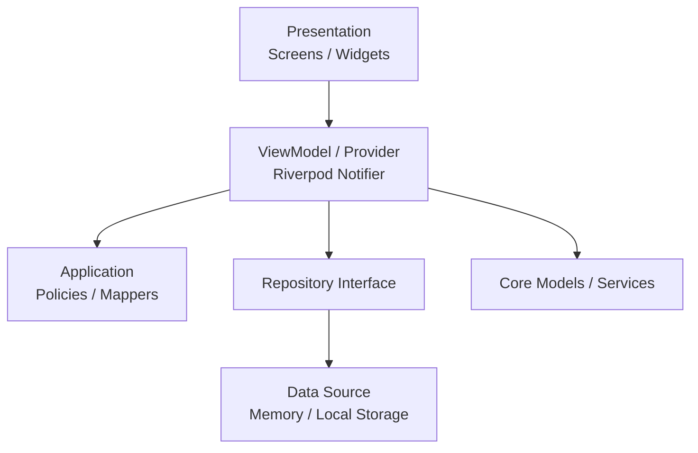

# Supplement Routine

> A Flutter Android app for managing supplement schedules, check-ins, history, notifications, and a home widget based only on rules entered by the user.

[한국어 README](README.md)

## Overview

Supplement Routine is not a supplement recommendation app or a medical advice app. It is a small routine management app that helps users register supplements they already decided to take and manage schedules and records based on their own rules.

The app focuses on a few clear goals.

- Check what to take today at a glance.
- Mark an intake as done right after taking it.
- Review recent history and completion rates.
- Receive notifications that include the registered supplement name.

## Features

| Feature | Description |
| --- | --- |
| Today | Shows today's date, daily message, progress, intake list, and check action. |
| Supplement Add/Edit | Supports name, intake method, intake condition, dosage, notification option, and memo. |
| Schedule Calculation | Generates today's schedule from meal-based, fixed-time, or interval rules. |
| History | Shows daily completion rates and recent two-week records. |
| Local Storage | Stores supplements, intake records, and settings on device. |
| Notifications | Reminds users which registered supplement is due. |
| Android Home Widget | Shows today's progress and next intake from the home screen. |
| Settings | Provides meal time settings, default notification setting, data reset, usage guide, and disclaimer. |

## App Policy

Supplement Routine does not provide:

- supplement recommendations
- supplement efficacy explanations
- disease prevention, treatment, or mitigation claims
- absorption rate advice
- food or supplement combination recommendations
- medical judgment or diagnosis

The app is only a schedule and record management tool based on user-entered information. Decisions about taking supplements should be discussed with a qualified professional.

## Tech Stack

| Area | Technology |
| --- | --- |
| Framework | Flutter |
| Language | Dart |
| State Management | Riverpod Notifier |
| Architecture | Feature-based MVVM, incremental Clean Architecture |
| Local Storage | SharedPreferencesWithCache |
| Localization | flutter_localizations, intl, ARB |
| Notification | flutter_local_notifications, timezone, flutter_timezone |
| Android Widget | Native Android AppWidgetProvider |
| Design System | Material Design 3, ThemeData, ColorScheme, TextTheme |
| Font | Pretendard |
| Test | flutter_test |

## Architecture

This project keeps the MVP scope small while aiming for a production-ready structure. Instead of splitting everything into many layers upfront, it introduces `data`, `application`, and `presentation` layers only where they are useful.



### Principles

- UI reads state and sends user events.
- State changes go through Riverpod Notifiers and repositories.
- User-facing strings are managed through ARB localization.
- Colors, typography, spacing, and radius are managed through ThemeData and design tokens.
- Mock data is injected explicitly through app configuration, not hidden inside local repositories.
- The app avoids features or copy that could be mistaken for medical advice.

## Project Structure

```text
lib/
├── app/
│   ├── app_config.dart
│   ├── app_theme.dart
│   ├── app_colors.dart
│   ├── app_typography.dart
│   ├── app_spacing.dart
│   ├── app_radius.dart
│   └── supplement_routine_app.dart
├── core/
│   ├── models/
│   ├── services/
│   └── utils/
├── features/
│   ├── today/
│   ├── supplement/
│   │   ├── application/
│   │   ├── data/
│   │   └── presentation/
│   ├── history/
│   │   └── data/
│   └── settings/
│       └── data/
└── l10n/
    ├── app_ko.arb
    └── generated/
```

Android home widget and native resources are managed under `android/app/src/main`.

## Getting Started

### Requirements

- Flutter SDK
- Android Studio
- Android Emulator or Android device

### Install Dependencies

```bash
flutter pub get
```

### Run

```bash
flutter run
```

### Debug Mock Data

Debug builds use mock data by default so the UI can be checked quickly.

```bash
flutter run --dart-define=MOCK_DATA=true
```

To verify empty states without mock data:

```bash
flutter run --dart-define=MOCK_DATA=false
```

## Configuration

`AppConfig` uses `--dart-define` values.

| Key | Default | Description |
| --- | --- | --- |
| `APP_NAME` | `Supplement Routine` | App name |
| `APP_FLAVOR` | `dev` | App flavor |
| `APP_VERSION` | `1.0.0` | Display version |
| `LOG_LEVEL` | `debug` | Log level |
| `MOCK_DATA` | debug: true, release: false | Whether to inject development mock data |

Secrets such as signing passwords, keystore paths, and sensitive API keys should not be committed to code or Git.

## Verification

### Analyze

```bash
flutter analyze
```

### Test

```bash
flutter test
```

### Android Debug Build

```bash
flutter build apk --debug
```

## Design System

Supplement Routine targets Android first and follows Material Design 3.

- `ThemeData(useMaterial3: true)`
- Color management through `ColorScheme`
- Pretendard static font files
- Shared tokens through `AppSpacing`, `AppRadius`, and `AppComponents`
- Light/Dark Theme support
- Clear information structure over decorative UI

See also:

- [Korean Design System](docs/design_system_ko.md)
- [Design System](docs/design_system.md)
- [Android Release Signing](docs/release_signing.md)

## Test Coverage

Current tests cover:

- app launch and main tabs
- supplement add, edit, and delete flows
- dosage validation
- default notification setting and per-supplement notification toggle
- today's schedule generation and intake check
- intake record persistence and completion rate calculation
- recent two-week history ViewModel
- local storage serialization
- home widget summary calculation
- notification body including the supplement name

## Current Status

The project currently has an MVP scope with a release-oriented structure.

- feature-based structure
- Riverpod Notifier state management
- local storage integration
- localization structure
- Material Design 3 design system
- basic Android notifications and home widget
- passing tests and debug APK build

## Roadmap

- localize notification channel/body strings
- continue replacing hardcoded UI tokens in the supplement form
- improve monthly calendar UX on the history screen
- prepare store graphics
- add screenshots/GIFs

## License

No license has been specified yet. A suitable license should be selected before distribution.
