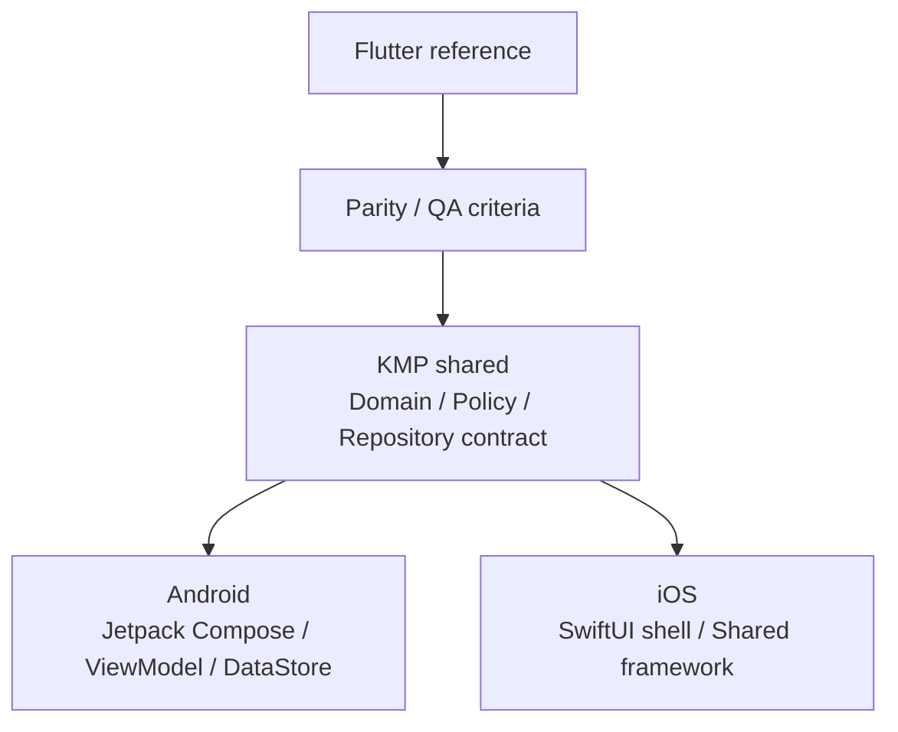

# Supplement Routine

> A local-first supplement routine app for user-entered intake rules, today schedules, check-ins, history, and notifications. The project keeps the original Flutter implementation as the reference while moving the Android-first release to KMP shared and Android Jetpack Compose. The iOS release is deferred.

[한국어 README](README.md)

## Current Status

| Area | Status |
| --- | --- |
| Android KMP | Android-first release scope. The latest `KMP Release` run `27008729353` generated and verified signed APK/AAB artifacts. |
| iOS KMP | SwiftUI shell, shared framework integration, UserDefaults persistence, and UserNotifications adapter are implemented. Release is deferred. |
| Flutter | Kept as the reference implementation and rollback source until Android store cutover and the iOS release restart decision. |
| CI | Flutter CI, KMP Android/shared CI, iOS framework + SwiftUI shell build CI are configured. |
| Remaining blocker | Play Console app setup, content rating, data safety, store listing, and review submission. |

The latest release-readiness state is tracked in [Release Readiness](docs/release_readiness.md).

## Overview

Supplement Routine is not a supplement recommendation app or a medical advice app. It helps users register supplements they already decided to take and manage schedules and records based on their own rules.

The app focuses on a few clear goals.

- Check what to take today at a glance.
- Mark an intake as done right after taking it.
- Review recent history and completion rates.
- Receive notifications for registered supplements.

## Features

| Feature | Description |
| --- | --- |
| Today | Shows today's date, progress, intake list, and check action. |
| Supplement Add/Edit | Supports name, intake method, condition, dosage, notification option, and memo. |
| Schedule Calculation | Generates today's schedule from meal-based, fixed-time, or interval rules. |
| History | Shows today's completion, monthly status, and recent records. |
| Local Storage | Stores supplements, intake records, meal times, and notification defaults on device. |
| Notifications | Supports Android runtime notification permission, exact-alarm fallback, and test notifications. |
| iOS Shell | Provides a SwiftUI Today/Supplements/History/Settings shell connected to the shared module. |
| Settings | Provides meal time settings, default notification setting, permission states, data reset, guide, and disclaimer. |

## App Policy

Supplement Routine does not provide:

- supplement recommendations
- supplement efficacy explanations
- disease prevention, treatment, or mitigation claims
- absorption rate advice
- food or supplement combination recommendations
- medical judgment or diagnosis

The app is only a schedule and record management tool based on user-entered information. Decisions about taking supplements should be discussed with a qualified professional.

## Tech Stack

| Area | Technology |
| --- | --- |
| Reference implementation | Flutter, Dart, Riverpod |
| Shared logic | Kotlin Multiplatform |
| Android native | Kotlin, Jetpack Compose, Material 3, Hilt, MVVM, DataStore |
| iOS native | SwiftUI, KMP shared framework, UserDefaults, UserNotifications |
| Notification | Android native notification/exact alarm adapter, iOS UserNotifications adapter, Flutter local notifications |
| Design System | Material 3, Pretendard, warm white/berry/coral/mint/ink tokens |
| CI/CD | GitHub Actions: Flutter CI, KMP CI, iOS KMP CI, KMP Release |

## Architecture

This project follows SSOT, Clean Architecture, SOLID, MVVM, and state hoisting principles for a maintainable local-first Android/iOS routine app. The Flutter implementation remains as the product reference, while the new native apps use KMP shared domain/data contracts and platform-specific UI.



## Project Structure

```text
lib/                         Flutter reference implementation
android/                     Flutter Android wrapper and native Android configuration
ios/                         Flutter iOS wrapper
kmp/
├── shared/                  KMP shared domain, data contract, pure logic
├── androidApp/              Jetpack Compose Android native app
└── iosApp/                  SwiftUI iOS shell, Xcode project
docs/                        PRD, design system, tech stack, parity, release docs
.codex/skills/               Project-specific workflow rules
```

## Getting Started

### Flutter Reference App

```bash
flutter pub get
flutter run
```

Debug mock data:

```bash
flutter run --dart-define=MOCK_DATA=true
```

Empty state without mock data:

```bash
flutter run --dart-define=MOCK_DATA=false
```

### KMP Android App

On Windows/Android development machines:

```powershell
$env:ANDROID_HOME="$env:LOCALAPPDATA\Android\Sdk"
$env:ANDROID_SDK_ROOT=$env:ANDROID_HOME
android\gradlew.bat -p kmp :shared:check :androidApp:assembleDebug --no-daemon
```

Debug APK:

```text
kmp/androidApp/build/outputs/apk/debug/androidApp-debug.apk
```

Release APK/AAB:

```powershell
$env:ANDROID_HOME="$env:LOCALAPPDATA\Android\Sdk"
$env:ANDROID_SDK_ROOT=$env:ANDROID_HOME
android\gradlew.bat -p kmp :shared:check :androidApp:assembleRelease :androidApp:bundleRelease --no-daemon
```

### KMP iOS App

The iOS SwiftUI shell requires macOS/Xcode. On Windows it is verified through GitHub-hosted macOS runners.

```bash
gradle -p kmp :shared:linkDebugFrameworkIosSimulatorArm64 --no-daemon
xcodebuild \
  -project kmp/iosApp/SupplementRoutineIos.xcodeproj \
  -scheme SupplementRoutineIos \
  -configuration Debug \
  -sdk iphonesimulator \
  -destination "generic/platform=iOS Simulator" \
  ARCHS=arm64 \
  ONLY_ACTIVE_ARCH=YES \
  CODE_SIGNING_ALLOWED=NO \
  build
```

## Release And Signing

Android signing is configured through GitHub Secrets, and the `KMP Release` workflow has generated and verified signed APK/AAB artifacts. The latest Android submission candidate is the `kmp-android-release` artifact from run `27008729353`.

iOS signed archive/IPA generation is configured, but the current release is Android-first. iOS signing/provisioning will be handled when the iOS release resumes.

Play Console automatic submission is not configured yet. The repository does not currently have a Play Console service account secret, so the account owner needs to upload the latest AAB to Play Console and submit it for review.

When the iOS release resumes, these assets are required:

- Apple distribution certificate `.p12`
- provisioning profile `.mobileprovision`
- certificate password
- Apple Team ID
- iOS Bundle ID

Secrets such as signing passwords, certificates, provisioning profiles, keystore files, and sensitive API keys must not be committed to code or Git. See [Release Signing](docs/release_signing.md).

## Verification

### Flutter

```bash
flutter analyze
flutter test
flutter build apk --debug
```

### KMP Android/shared

```powershell
$env:ANDROID_HOME="$env:LOCALAPPDATA\Android\Sdk"
$env:ANDROID_SDK_ROOT=$env:ANDROID_HOME
android\gradlew.bat -p kmp :shared:check :androidApp:assembleDebug --no-daemon
```

### KMP iOS

`.github/workflows/ios_kmp_ci.yml` verifies the `SupplementRoutineShared` framework and SwiftUI shell build on a macOS runner.

## QA Status

Completed checks include:

- Android release APK/AAB assemble, bundle, and lint
- Android signed APK/AAB artifact generation and signature verification
- Android release APK install/launch smoke
- Android phone/expanded-width screenshot QA
- Android notification runtime permission allow/deny
- Android exact-alarm settings/fallback
- Android immediate/scheduled notification smoke
- iOS shared release XCFramework build
- iOS SwiftUI shell simulator build CI

Remaining external dependencies:

- long-running notification QA at real user routine times
- Play Console app setup, content rating, data safety, store listing, and review submission
- Play Console service account secret registration for automatic submission
- iOS signing/provisioning, signed archive/IPA, and screenshot/accessibility QA are deferred to the follow-up iOS release

## Docs

- [PRD](docs/prd.md)
- [Information Architecture](docs/information_architecture.md)
- [User Flow](docs/user_flow.md)
- [Design System](docs/design_system.md)
- [Tech Stack](docs/tech_stack.md)
- [KMP Parity](docs/kmp_parity_check.md)
- [Release Readiness](docs/release_readiness.md)
- [Release Signing](docs/release_signing.md)
- [Android Play Console Submission](docs/play_console_android_submission.md)
- [Privacy Policy](docs/privacy_policy.md)
- [CI/CD](docs/ci_cd.md)
- [Windows Support](docs/windows_support.md)

## Screenshots

| Today | Supplements |
| --- | --- |
|  |  |

| History | Settings |
| --- | --- |
|  |  |

### Android Home Widget


### Intake Notification


## License

No license has been specified yet. A suitable license should be selected before distribution.
