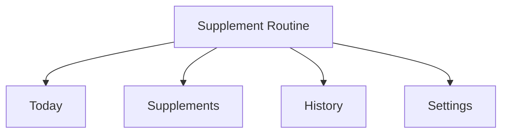
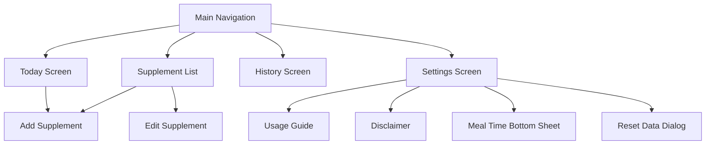

# Supplement Routine Information Architecture

## 1. Product Definition

Supplement Routine is a routine management tool that organizes schedules, check-ins, history, and reminders from rules entered by the user. It is not a medical advice or supplement recommendation product.

## 2. Top-Level Navigation

| Tab | Purpose | Frequency | Primary Question |
| --- | --- | --- | --- |
| Today | Current action | Very high | What should I take today? |
| Supplements | Rule management | Medium | What did I register and how? |
| History | Outcome review | Medium | How consistently have I followed the routine? |
| Settings | Shared preferences | Low | What are my default meal times and reminder settings? |

## 3. Screen Hierarchy

## 4. Screen Structure

### Today

1. Date
2. Daily message
3. Daily progress
4. Intake list
5. Add supplement FAB

### Supplements

1. Registered supplement list
2. Name
3. Method and daily count
4. Dosage
5. Memo
6. Reminder toggle / edit / delete
7. Add supplement FAB

### Add / Edit Supplement

1. Name
2. Dosage and unit
3. Intake method
4. Detailed schedule rule
5. Reminder toggle
6. Memo
7. Save CTA

### History

1. Today's summary
2. Monthly completion calendar
3. Recent two-week list

### Settings

1. Defaults
2. Meal time setup
3. Default reminder preference
4. Data management
5. Information
6. App version

## 5. Core Objects

| Object | Meaning | Main Screens |
| --- | --- | --- |
| Supplement | User-entered supplement rule | Supplements, Add/Edit |
| IntakeRecord | Completion record for a date/time | Today, History |
| MealTimeSettings | Shared meal time defaults | Settings, Scheduling |
| Notification Settings | Shared reminder preference | Settings, Add/Edit |

## 6. Shared States

| State | Screens | UX Requirement |
| --- | --- | --- |
| Empty | Today, Supplements, History | Clearly explain the next action |
| Success | Check-in, save | Prefer state reflection over celebration |
| Disabled | Buttons, toggles | Reason should be clear from context |
| Error | Form validation | State the issue and the fix |

## 7. Extension Principles

- Try to fit new work inside the existing four top-level destinations first.
- Do not add features that turn the product into medical advice.
- Prefer extending the existing `Supplement` and `IntakeRecord` concepts for schedule and history work.
- Optimize for repeated daily workflows before adding more screens.
