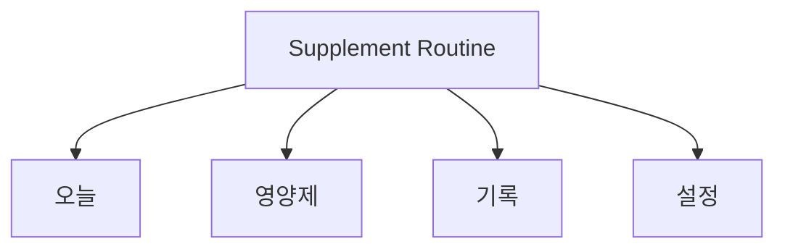
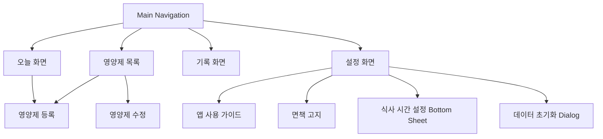

# Supplement Routine 정보 구조(IA)

## 1. 제품 정의

Supplement Routine은 사용자가 직접 입력한 영양제 복용 규칙을 기준으로 일정, 체크, 기록, 알림을 관리하는 루틴 도구입니다. 의료 조언이나 영양제 추천이 아니라, 사용자가 이미 정한 루틴을 정확히 확인하고 기록하도록 돕는 것이 목적입니다.

## 2. 최상위 내비게이션

| 탭 | 목적 | 사용 빈도 | 주요 질문 |
| --- | --- | --- | --- |
| 오늘 | 현재 해야 할 일 확인 | 매우 높음 | 오늘 무엇을 먹어야 하지? |
| 영양제 | 복용 규칙 관리 | 중간 | 어떤 영양제를 어떤 규칙으로 등록했지? |
| 기록 | 수행 결과 확인 | 중간 | 최근에 얼마나 잘 지켰지? |
| 설정 | 공통 환경 관리 | 낮음 | 식사 시간과 알림 기본값은 어떻게 되어 있지? |

## 3. 화면 계층

## 4. 화면별 정보 구조

### 오늘

1. 날짜
2. 오늘의 한 줄
3. 오늘 루틴 진행률
4. 오늘 복용 목록
5. 영양제 추가 FAB

정보 우선순위는 “오늘 할 일”이 가장 높습니다. 사용자가 앱을 열자마자 다음 행동을 알 수 있어야 합니다.

### 영양제

1. 등록된 영양제 목록
2. 이름
3. 복용 방식과 하루 횟수
4. 1회 복용량
5. 메모
6. 알림 토글 / 수정 / 삭제
7. 영양제 추가 FAB

목록 화면은 비교와 유지보수가 목적이므로 카드 밀도는 낮추되 스캔성이 높아야 합니다.

### 영양제 등록/수정

1. 이름
2. 복용량과 단위
3. 복용 방식
4. 세부 시간 규칙
5. 알림 여부
6. 메모
7. 저장 CTA

폼은 사용자가 규칙을 빠뜨리지 않고 입력하도록 위에서 아래로 자연스럽게 진행됩니다.

### 기록

1. 오늘 기록 요약
2. 이번 달 완료율 캘린더
3. 최근 2주 기록 리스트

기록 화면은 “오늘 결과”에서 “월간 패턴”, “최근 세부 기록” 순으로 내려가며 읽히도록 구성합니다.

### 설정

1. 기본 설정
2. 식사 시간 설정
3. 기본 알림 설정
4. 데이터 관리
5. 정보
6. 앱 버전

설정은 자주 쓰지 않는 화면이므로 섹션 구분이 명확해야 합니다.

## 5. 핵심 객체

| 객체 | 의미 | 표시 위치 |
| --- | --- | --- |
| Supplement | 사용자가 등록한 영양제 자체 | 영양제 목록, 등록/수정 |
| IntakeRecord | 특정 날짜와 시간의 복용 기록 | 오늘, 기록 |
| MealTimeSettings | 기본 식사 시간 | 설정, 일정 계산 |
| Notification Settings | 기본 알림 여부 | 설정, 등록 폼 기본값 |

## 6. 공통 상태

| 상태 | 적용 위치 | 요구 UX |
| --- | --- | --- |
| Empty | 오늘, 영양제, 기록 | 사용자가 다음 행동을 이해할 수 있어야 함 |
| Success | 복용 체크, 저장 | 과도한 축하보다 상태 반영 우선 |
| Disabled | 버튼, 토글 | 왜 비활성인지 맥락으로 이해 가능해야 함 |
| Error | 폼 validation | 문제와 해결 방법을 즉시 알 수 있어야 함 |

## 7. 확장 원칙

- 새로운 기능은 4개 최상위 탭 안에서 해결 가능한지 먼저 검토합니다.
- 건강 조언처럼 제품 범위를 바꾸는 기능은 추가하지 않습니다.
- 일정/기록 관리 기능은 가능한 한 기존 객체(`Supplement`, `IntakeRecord`)를 확장해 수용합니다.
- 화면 수보다 사용자가 매일 반복하는 작업의 짧은 동선을 우선합니다.
