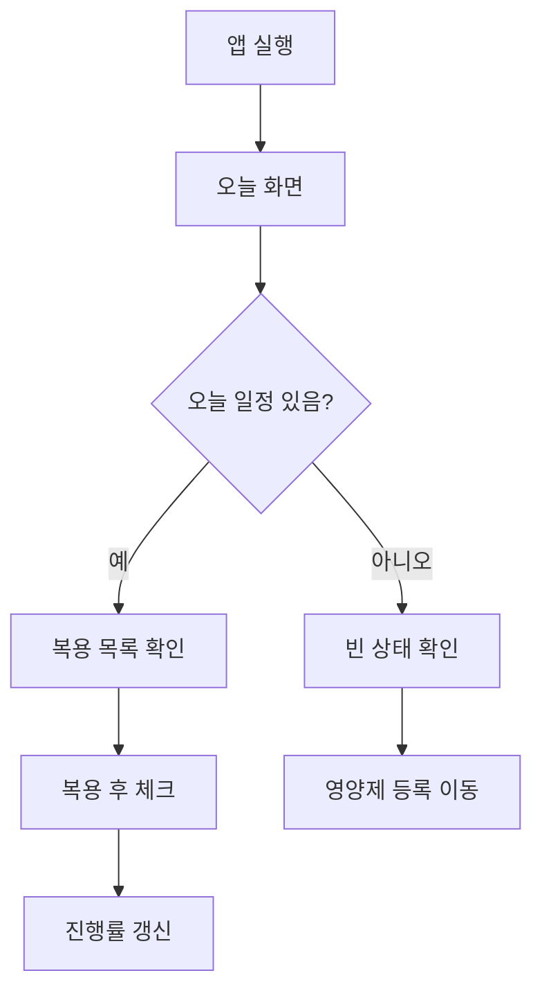
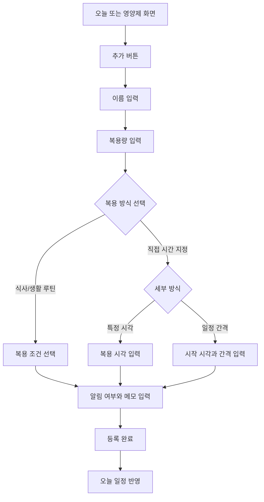
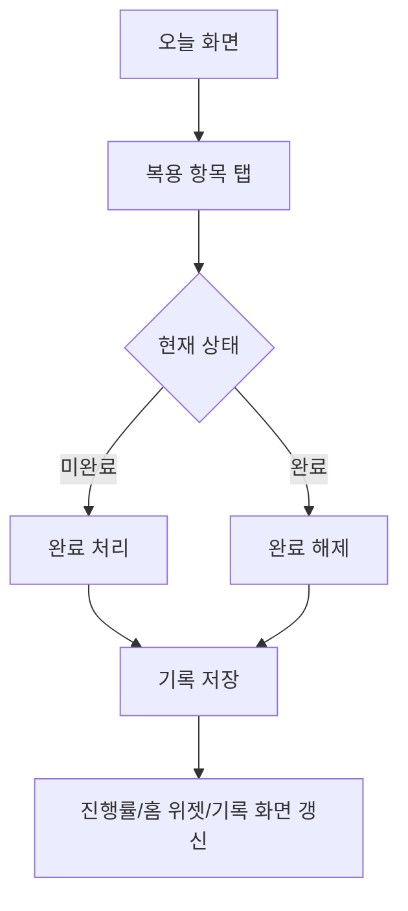
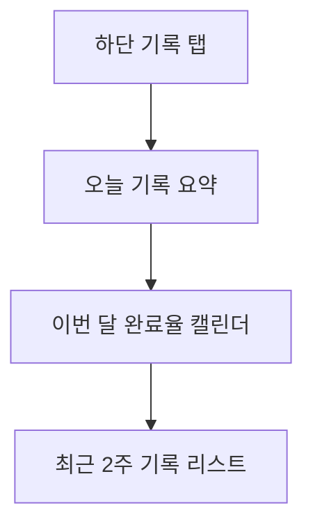
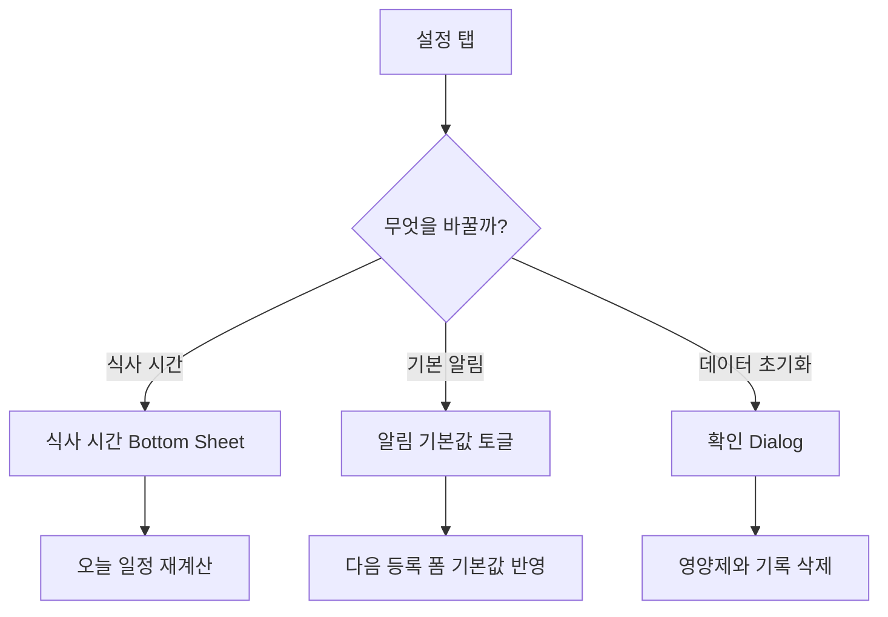
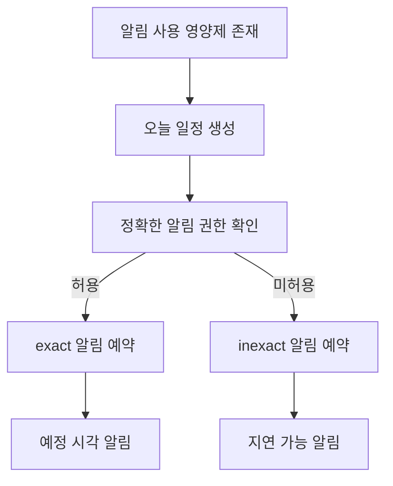

# Supplement Routine 사용자 흐름

이 문서는 `docs/prd.md`의 제품 목표와 포함 범위를 기준으로 핵심 사용자 흐름을 설명합니다.

## 1. 대표 사용자 목표

1. 오늘 먹어야 할 영양제를 확인한다.
2. 복용 후 체크한다.
3. 새로운 영양제 복용 규칙을 등록한다.
4. 최근 기록을 돌아본다.
5. 알림과 식사 시간 기준을 조정한다.

## 2. 기본 흐름

## 3. 영양제 등록 흐름

## 4. 복용 체크 흐름

## 5. 기록 확인 흐름

## 6. 설정 변경 흐름

## 7. 알림 흐름

## 8. 예외 흐름

| 상황 | 시스템 반응 | 사용자 기대 |
| --- | --- | --- |
| 영양제 이름 누락 | 저장 차단 + 오류 문구 | 무엇을 고쳐야 하는지 즉시 알 수 있음 |
| 복용량 0 이하 | 저장 차단 + 오류 문구 | 허용 범위를 이해할 수 있음 |
| 루틴 조건 미선택 | 저장 차단 + 오류 문구 | 필수 입력 누락을 알 수 있음 |
| 일정 없음 | 빈 상태 노출 | 바로 등록 행동으로 이어질 수 있음 |
| 정확한 알림 권한 미허용 | inexact 알림 폴백 + 설정 화면에서 권한 안내 | 사용자가 지연 가능성을 이해하고 권한을 다시 허용할 수 있음 |

## 9. UX 원칙

- 첫 진입 후 3초 안에 오늘 할 일을 이해할 수 있어야 합니다.
- 복용 체크는 한 번의 탭으로 끝나야 합니다.
- 등록 흐름은 건강 지식이 없어도 완료할 수 있어야 합니다.
- 사용자가 반복적으로 보는 화면일수록 장식보다 스캔성을 우선합니다.
- 의료적 판단이 필요한 질문은 제품 범위 밖으로 둡니다.
