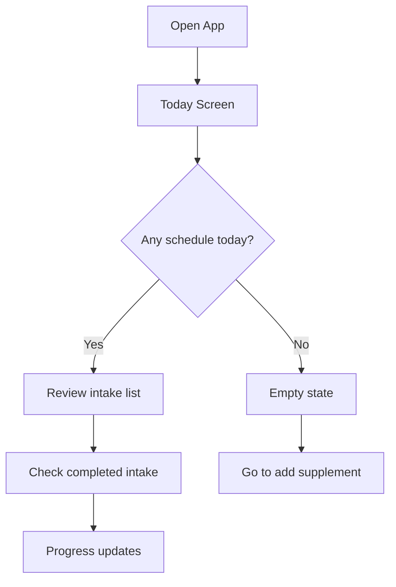
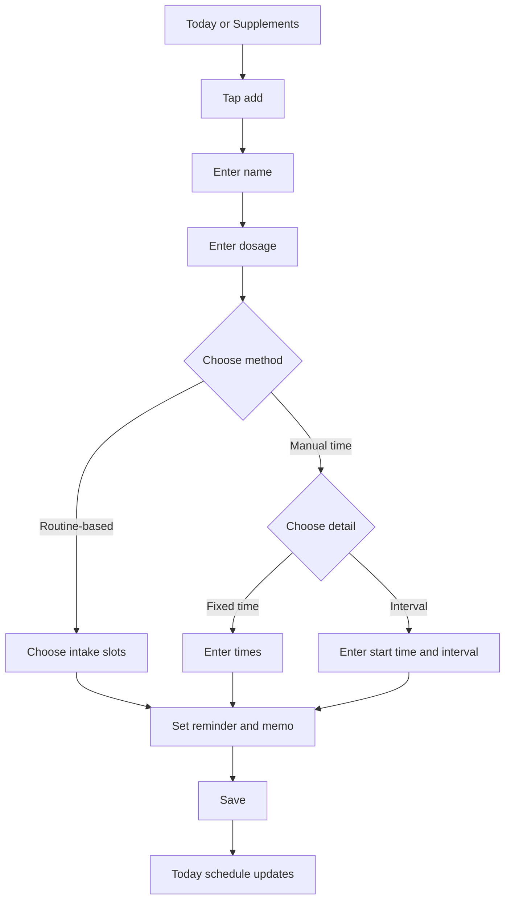
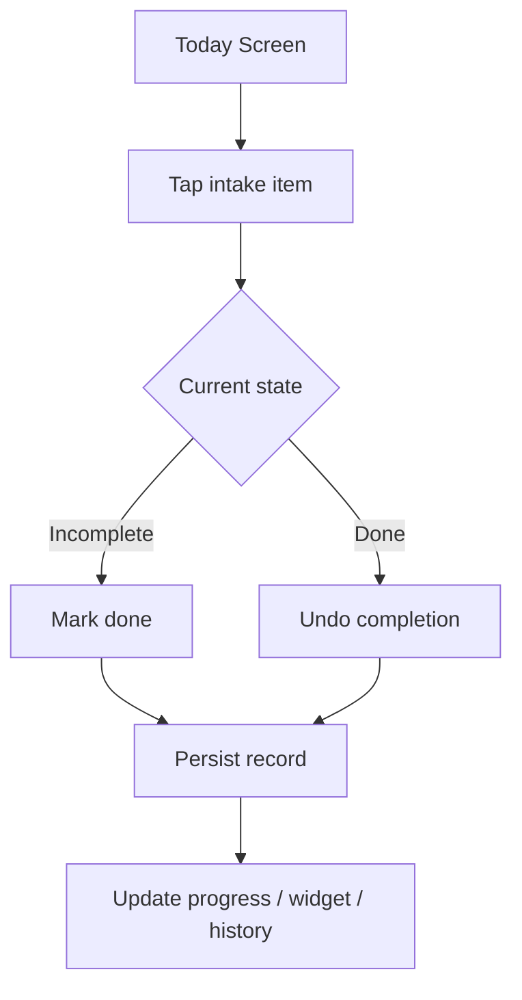
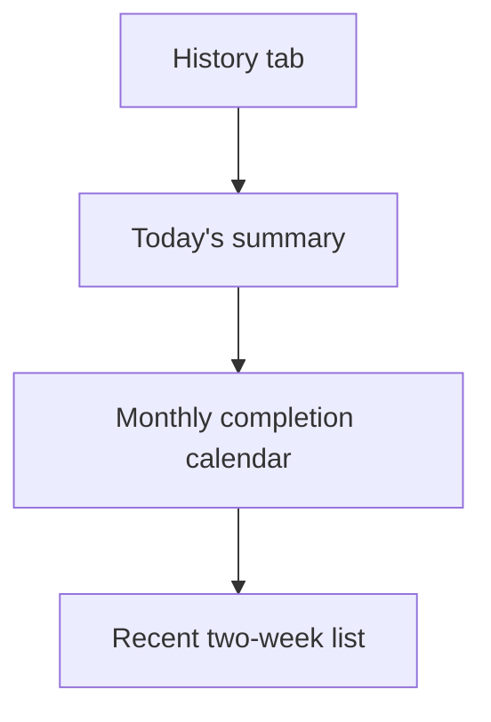
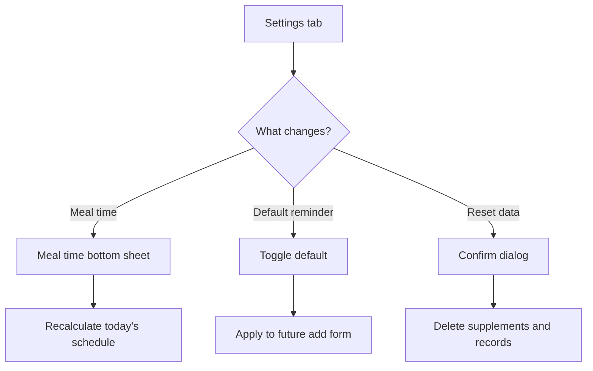
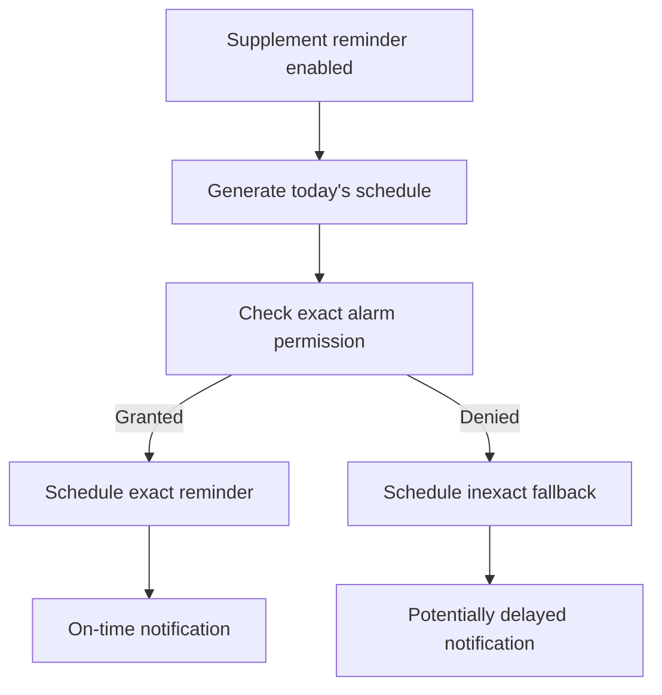

# Supplement Routine User Flow

## 1. Primary User Goals

1. Check what to take today.
2. Mark an intake as completed.
3. Register a new supplement rule.
4. Review recent history.
5. Adjust reminder and meal-time defaults.

## 2. Core Flow

## 3. Add Supplement Flow

## 4. Check-In Flow

## 5. History Flow

## 6. Settings Flow

## 7. Notification Flow

## 8. Exception Flows

| Situation | System Response | User Need |
| --- | --- | --- |
| Missing supplement name | Block save + validation message | Know what to fix immediately |
| Dosage is zero or less | Block save + validation message | Understand allowed input |
| Routine slots missing | Block save + validation message | Know that a required field is missing |
| No schedule today | Show empty state | Reach registration action quickly |
| Exact alarm permission denied | Fall back to inexact reminders and show guidance in Settings | Users can understand the delay risk and re-enable the permission |

## 9. UX Principles

- Users should understand today's next action within 3 seconds.
- Check-in should take one tap.
- Registration should not require health expertise.
- High-frequency screens favor scanability over decoration.
- Medical judgment stays outside product scope.
